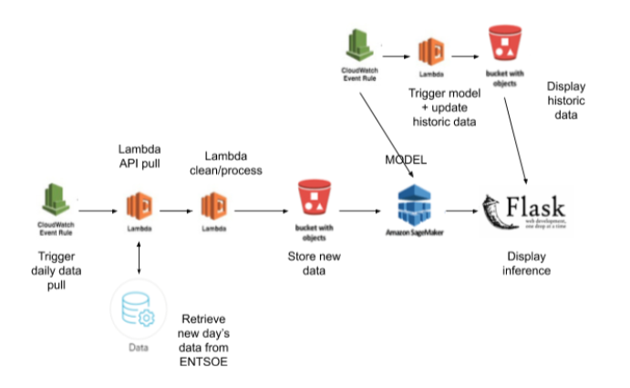

# Energy Dashboard Webapp

**Project Status [In Progress]**

## Dashboard
This is an end-to-end machine learning pipeline that predicts energy demand for the next 24 hour period. The repo contains code to train, and  deploy a machine learning prediction service that ingests, processes, and makes inference with an LSTM.

## Background
Day ahead energy forecasts are predictions of the expected energy consumption or generation over the next 24 hours. They guide energy traders, grid operators, and generation stations as an integral part of the electrical grid infrastructure. Electrical markets rely on stability and the balance between demand and generation. Part of this balance is achieved by being able to plan resources. This means know how much energy to produce, and when to produce it. Forecasting forms an integral part of predicting how much electrical capacity to have ready to produce.

## Project Resources

### DATASETS AND INPUTS
This project will narrow its focus to predicting electrical consumption demand in Spain. A dataset for this is available on kaggle. Additional data is available from the ENTSO-E transparency platform and may be downloaded directly or accessed via API.
Model inputs will be limited in order to simplify the problem and focus on the engineer pipeline. The following inputs will be used:
- Historical consumption up to the last 90-365 days
- Day of the week and hour of the day

### SOLUTION STATEMENT
The objectives of this project are twofold:
- Design and implement a serverless data pipeline that each 24 hours automatically retrieves consumption data, processes the data, stores the data, makes inference for the next 24 hour period, and displays both prediction and historical results on a small web application.
- Implement an LSTM neural network that predicts energy consumption 24 hours in advance.

## Learning Objectives
The focus of this project is setting up the infrastructure and data pipeline to make inference. The learning goals are:
- Setup an end-to-end data pipeline with Google Cloud Platform, Airflows, and Cloud Functions
- Deploy a Tensorflow LSTM model for inference.
- Configure a flask web app to display the daily predictions.
- Work within a continuous deployment environment

## Methods Used
- Data Engineering
- Data Cleaning
- Timeseires inference

## Technologies
- Python, Numpy, Pandas
- Requests & Rest API, Json
- Flask, Gunicorn
- Tensorflow
- Google Cloud Storage and Functions
- Airflows

## Baseline Models
Two models are used as the baseline for evaluating the neural network model.
- Persistence Model: A persistence model uses a previous time step as the prediction for the future timestep. It is a direct mapping of the previous period to the predicted period. Three persistence models will be calculated
Demand from the same hour of the previous day. I.E. Hour 5 from today is used as the prediction for hour 5 tomorrow.
- Three day moving average of each hour in the day. I.E. calculate 24 moving averages of the last 3 days, for hours 0 to 23 and use this set as the prediction.

All models are compared gainst the actual day-ahead predictions from  Red Española Electrica.

## Model
Since this project focuses on the deployment of a model and the supporting data infrastructure it will use an LSTM model already developed. The model can be found at [this repo](https://github.com/nicholasjhana/short-term-energy-demand-forecasting). And example of the LSTM model used can also be found in [this kaggle kernel](https://www.kaggle.com/nicholasjhana/univariate-time-series-forecasting-with-keras).

## Metrics
All models will be evaluated using the mean absolute percentage error (MAPE). Two variants are used as key indicators.
- MAPE calculated for each hour of the day to see where the model is predicting poorly/well.
- MAPE as the cumulative model error to compare models against the baselines.

